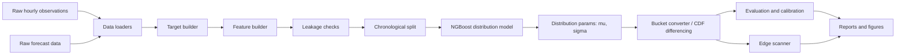

# Project UML / Architecture

The diagram below is a Mermaid architecture view of the project. It shows how the project moves from raw weather data to calibrated bucket probabilities and presentation outputs.

## Component Responsibilities

| Component | Responsibility | Representative files |
|---|---|---|
| Data loaders | Load cleaned observation and forecast data. | `src/weather_data.py`, `src/forecast_data.py`, `src/features.py` |
| Target builder | Build `forecast_error = actual_high - forecast_high` rows. | `src/target_builder.py`, `src/supervised_table.py` |
| Feature builder | Add timestamp-safe calendar, weather, forecast-relative, and intraday path features. | `src/features.py`, `scripts/build_features.py` |
| Leakage checks | Verify that model features do not include final outcomes or future timestamps. | `src/leakage_checks.py` |
| Splitter | Keep train, validation, and test periods chronological. | `src/splits.py` |
| Distribution model | Fit NGBoost/DGBM-style distributions over forecast error. | `src/train_ngboost.py`, `src/distributional_model.py` |
| Bucket converter | Convert final-high buckets to forecast-error intervals and compute `F(b) - F(a)`. | `src/distribution_pricing.py`, `src/interval_probs.py`, `src/bucket_schema.py` |
| Evaluator | Score probability quality with NLL, Brier score, coverage, PIT, and calibration. | `src/evaluation.py`, `src/calibration.py`, `scripts/evaluate_ngboost.py` |
| Edge scanner | Compare model probabilities against market-implied probabilities when market prices are available. | Presentation/demo logic; full live trading is future work. |
| Outputs | Save predictions, validation reports, plots, and notebook artifacts. | `outputs/`, `outputs/figures/`, `models/` |

